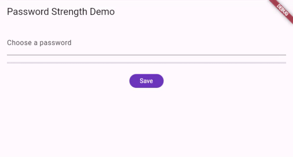

# password_strength

A password strength calculator, validator & indicator for Flutter.



## Getting Started

In your `pubspec.yaml` add:

```yaml
dependencies:
  password_strength:
    git:
      url: https://github.com/PixelBeardAgency/password_strength.git
      ref: master # or a specific branch, tag or commit
```

To use this package,

```dart
import 'package:password_strength/password_strength.dart'
```

## Usage

A `PasswordStrengthCalculator` is used to calculate the strength of a password.

It is constructed with any number of `PasswordCriteria` objects, which are used to determine the strength & validity of a password.

A `PasswordIndicator` is a widget that displays the strength of a password. It is constructed with a `PasswordStrengthCalculator` and displays the strength along with any validation messages each time the `calculate` method is called.

### Simple Example

```dart
class MyHomePage extends StatelessWidget {
  /// Create a password strength calculator with the following criteria:
  final PasswordStrengthCalculator _calculator = PasswordStrengthCalculator([

    /// Password must be at least 8 characters long.
    PasswordCriteria.length(8),

    /// Password must contain an uppercase letter.
    PasswordCriteria.uppercase(),

    /// Password must contain a lowercase letter.
    PasswordCriteria.lowercase(),

    /// Password must contain a number.
    PasswordCriteria.number(),

    /// Password must contain a special character.
    PasswordCriteria.specialCharacter(),

    /// Password cannot contain more than 2 sequential characters.
    PasswordCriteria.sequentialCharacters(),

    /// Custom criteria can be defined as follows.
    ///
    /// Password cannot contain the phrase password.
    PasswordCriteria(
        'Password cannot contain the phrase password.',
        (password) =>
            !password.contains(RegExp(r'password', caseSensitive: false)))
  ]);

  MyHomePage({
    super.key,
  });

  @override
  Widget build(BuildContext context) {
    return Scaffold(
      body: Padding(
          padding: const EdgeInsets.all(16),
          child: Column(
            children: [
              TextField(
                decoration: const InputDecoration(
                  labelText: 'Choose a password',
                ),

                /// Calculate the strength of the password each time the text changes.
                onChanged: (value) => _calculator.calculate(value),
              ),
              const SizedBox(height: 16),

              /// Display the strength of the password.
              PasswordStrengthIndicator(calculator: _calculator),
            ],
          ),
        ),
    );
  }
}

```
